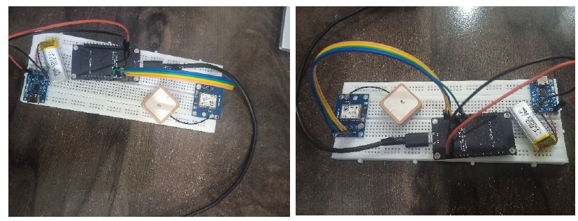
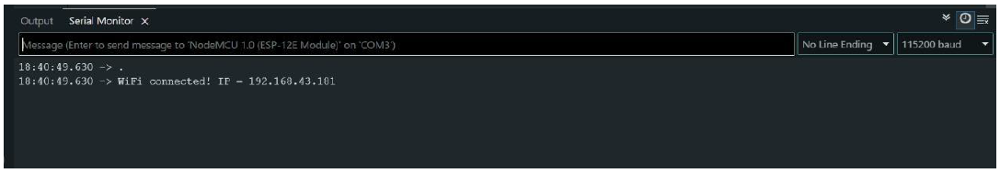
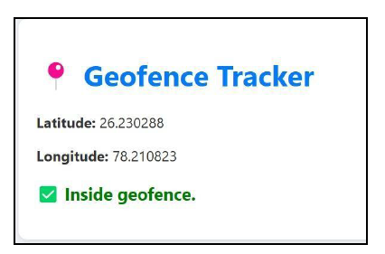
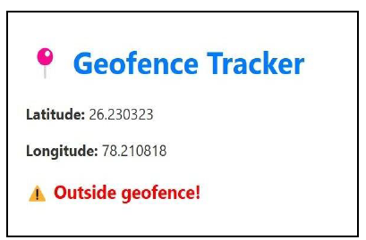

Geofence Tracker Project Results

Hardware Setup:

The hardware setup consists of:

NodeMCU ESP8266 microcontroller
NEO-6M GPS module
TP4056 charging module
900 mAh Li-ion battery

WiFi Connection:

The device connects to a WiFi hotspot to transmit location data.

Geofence Detection:

The geofence is defined around a specific area. The device detects whether it is inside or outside the geofence and sends alerts in the local web page.

Inside Geofence:

Outside Geofence:

